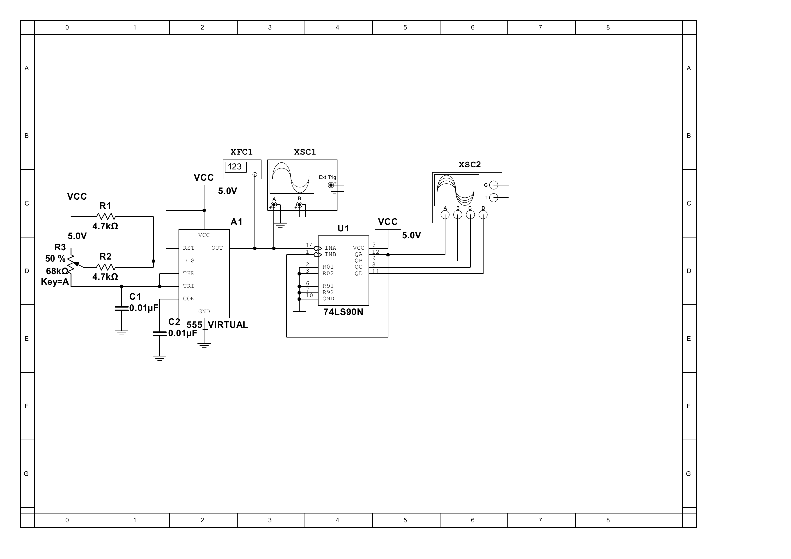
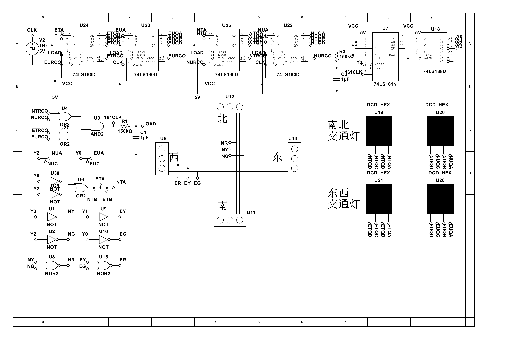
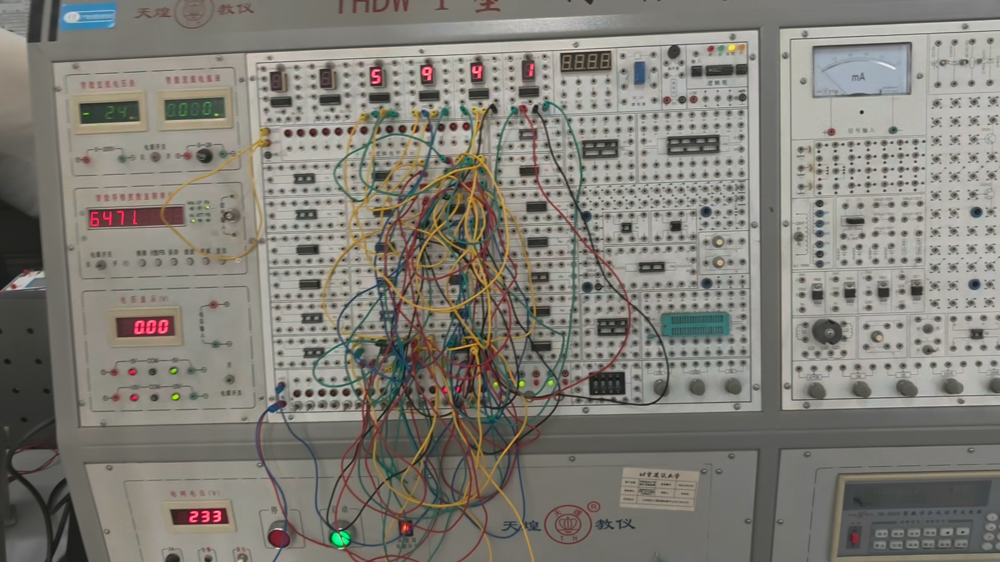

# 电子技术课程设计报告

## 1 设计题目

本次课程设计包括频率可调的多谐振荡器及十分频电路、简易十字路口红绿交通灯电路和数字时钟电路。报告分别说明仿真阶段完成的电路和实际搭接完成的电路，所有器件和连接关系均以实际完成情况为准。

### 1.1 仿真实验内容

仿真阶段完成两个电路。第一部分为频率可调的多谐振荡器及十分频电路，使用 555 定时器产生矩形脉冲，再由 74LS90 进行十分频，通过频率计和示波器观察振荡及计数输出。第二部分为简易十字路口红绿交通灯电路，使用 1 Hz 时钟源、四片 74LS190、74LS161、74LS138、组合逻辑和四个 HEX 数码显示器，实现东西、南北两个方向的红、黄、绿灯控制及倒计时显示。

### 1.2 实际搭接内容

实际搭接完成三个电路。频率可调的多谐振荡器及十分频电路使用 NE555 和 74LS90；交通灯电路使用四片 74LS192、一片 74LS90、若干 TTL 逻辑门、四个数码管和六个 LED；数字时钟电路使用四片 74LS90 和四个数码管，实现秒、分显示及 60 进位。交通灯和数字时钟的时钟信号由信号发生器提供，各电路均使用实验台电源供电。

频率可调的多谐振荡器及十分频电路通过调节定时网络改变振荡频率，并观察分频前后的波形。交通灯电路按照四个主要灯态完成状态切换、倒计时和灯光显示。数字时钟电路完成秒、分计数及进位显示。

## 2 电路设计与仿真

### 2.1 EDA 软件介绍

EDA 是 Electronic Design Automation 的缩写，即电子设计自动化。使用 EDA 软件，可以在实际搭接前完成原理图绘制、电路仿真、逻辑状态检查和波形观察，提前发现器件选型、逻辑关系和时序配合中的问题。

本次仿真使用 Multisim 14.3。在频率可调的多谐振荡器及十分频电路中，使用频率计和示波器观察 555 输出及 74LS90 各级输出；在交通灯电路中，通过四个 HEX 数码显示器和交通灯指示模块观察倒计时及东西、南北两个方向的灯光状态。

仿真的作用不仅是观察显示效果，还包括检查计数器的终端计数信号、状态计数器的切换时刻以及并行置数信号之间的时序关系。交通灯电路在设计过程中出现过状态切换与置数不同步的问题，最终通过仿真定位并解决了时序竞争。

### 2.2 系统总体功能与结构

本次设计可以分成三个相对独立的模块。频率可调的多谐振荡器及十分频电路由 555、外接电阻电容和 74LS90 构成；交通灯仿真电路由 1 Hz 时钟源、四片 74LS190、74LS161、74LS138、组合逻辑、四个 HEX 数码显示器和交通灯显示部分构成；数字时钟只在实物阶段搭接，由四片 74LS90 和四个数码管构成。

频率可调的多谐振荡器及十分频电路、交通灯电路和数字时钟电路分别按照模块进行设计、仿真和搭接。交通灯实物电路根据实验室现有器件重新完成状态译码和组合逻辑连接。

#### 2.2.1 555 及分频电路

555 及分频电路由振荡网络、计数分频网络和波形观察网络组成。振荡网络由 555、定时电阻和定时电容构成，555 输出的矩形脉冲作为 74LS90 的时钟输入；74LS90 通过 QA 与 INB 的反馈连接，内部二分频和五分频单元级联，形成模十计数。频率计连接在 555 输出端，用于观察振荡频率；示波器一组通道观察 555 输出，另一组通道观察 74LS90 的计数输出，从而比较分频前后的波形关系。

#### 2.2.2 红绿灯电路

红绿灯电路由时钟网络、倒计时网络、状态控制网络、状态译码网络、置数网络、灯光输出网络和显示网络组成。1 Hz 时钟驱动两方向倒计时计数器；当任一方向的两位计数器达到 00 时，终端计数信号形成状态推进信号；74LS161 保存当前状态，74LS138 将状态译码为 Y0～Y3；状态译码信号一方面产生下一阶段的倒计时预置值，另一方面经组合逻辑产生红、黄、绿灯控制信号；四片 74LS190 的 BCD 输出分别送入四个 HEX 数码显示器。状态推进信号直接驱动状态计数器，同时经 RC 网络延时后送至计数器 LOAD 端，以实现先切换状态、后完成置数。

### 2.3 元器件选型与作用

#### 2.3.1 555 定时器

555 定时器可以构成单稳态、双稳态和无稳态电路。本设计把它接成无稳态多谐振荡器，电容在内部比较器和放电管的控制下反复充放电，输出端因此产生连续的矩形脉冲。仿真图中使用的是 Multisim 的 `555_VIRTUAL` 模型，实物使用的是 NE555。

#### 2.3.2 74LS90

74LS90 是异步十进制计数器，内部包含二分频和五分频单元。将 QA 反馈到 INB 后，计数状态按 0000～1001 循环，可以实现模十计数。该芯片在多谐振荡器电路中用于十分频，在交通灯实物中用于状态控制，在数字时钟中用于十进制和六十进制计数，各部分根据功能采用相应的反馈和清零逻辑。

#### 2.3.3 74LS190 与 74LS192

74LS190 和 74LS192 都可以完成可预置 BCD 加、减计数，但两者的计数控制方式和引脚定义不同。交通灯仿真使用四片 74LS190，分别作为东西方向十位、东西方向个位、南北方向十位和南北方向个位计数器。实物中因为实验室没有 74LS190，改用四片 74LS192，并根据 74LS192 的加、减时钟端和借位输出重新设计连接。因此，这一变化属于按器件特性重新设计，不是简单的同引脚替换。

#### 2.3.4 74LS161、74LS138 与实物替代逻辑

仿真中的 74LS161 用于产生循环状态码，74LS138 把状态码译码成低有效状态信号，其中 Y0～Y3 控制四个主要灯态。实物中没有 74LS161，也没有 74LS138，因此使用一片 74LS90 重新构成状态计数部分，并直接根据状态计数器输出重新计算灯光和置数逻辑。

实验室同时缺少或门和或非门芯片，所以实物中的相关逻辑主要依据德摩根定律，用与非门和非门重新表示，实际使用的是实验室现有的 TTL 逻辑门。

#### 2.3.5 显示器和指示灯

仿真中的 DCD_HEX 是 Multisim 自带的带译码虚拟显示器，可以直接显示四位 BCD 输入对应的十六进制数字。本设计只使用 0～9，因此它在仿真中作为十进制倒计时显示器使用。实物电路使用四个数码管显示东西、南北两个方向的倒计时。

交通灯实物使用 6 个 LED，分别表示东西方向和南北方向的红、黄、绿灯。

### 2.4 频率可调的多谐振荡器及十分频电路

#### 2.4.1 555 多谐振荡器设计

仿真中的多谐振荡器使用 5.0 V 电源，两个固定电阻均为 4.7 kΩ，电位器的标称阻值为 68 kΩ，有效阻值调至约 64.95 kΩ；定时电容和控制端旁路电容均为 0.01 μF。电位器的滑动端与其中一端作为可变电阻使用，通过改变有效阻值调节电容的充放电时间。

复位端 RST 接高电平，使 555 保持工作；阈值端 THR 与触发端 TRI 相连，并通过定时电容接地；控制端 CON 通过旁路电容接地，以减小干扰。输出端同时接到频率计、示波器和 74LS90 的 INA 端。

该部分的仿真参数如表1所示。

**表1  多谐振荡器仿真参数**

| 元件 | 参数 | 作用 |
| --- | --- | --- |
| 固定电阻 | 4.7 kΩ，2 个 | 构成定时网络 |
| 电位器 | 68 kΩ，调至约 64.95 kΩ | 使理论振荡频率约为 1 kHz |
| 定时电容 | 0.01 μF | 决定充放电时间 |
| 旁路电容 | 0.01 μF | 稳定控制端电压 |
| VCC | 5.0 V | 仿真电源 |

令 $R_A$ 为电源端至放电端之间的等效电阻，$R_B$ 为放电端至定时电容之间的等效电阻，$C$ 为定时电容。按照常用 555 无稳态电路的近似计算，振荡频率和高、低电平时间可写为：

$$
t_H\approx0.693(R_A+R_B)C
$$

$$
t_L\approx0.693R_BC
$$

$$
f\approx\frac{1.44}{(R_A+2R_B)C}
$$

式中，$t_H$ 和 $t_L$ 分别为输出高、低电平的持续时间，单位为 s；$f$ 为振荡频率，单位为 Hz；$R_A$ 和 $R_B$ 为定时网络的等效电阻，单位为 Ω；$C$ 为定时电容，单位为 F。进行数值计算时，各物理量应换算为一致的单位。

设电位器的有效阻值为 $R_P$，则 $R_B=4.7\ \mathrm{k\Omega}+R_P$。将目标频率 $f=1000\ \mathrm{Hz}$、$R_A=4.7\ \mathrm{k\Omega}$、$C=0.01\ \mathrm{\mu F}$ 代入频率公式，可得：

$$
R_P=\frac{1}{2}\left(\frac{1.44}{fC}-R_A\right)-4.7\ \mathrm{k\Omega}\approx64.95\ \mathrm{k\Omega}
$$

式中，$R_P$ 为电位器接入定时网络的有效阻值，单位为 kΩ；其余符号的含义与前述公式相同。

因此，68 kΩ 电位器应调至约 95.5%，此时理论振荡频率约为 1 kHz，理论占空比约为 51.6%。经过 74LS90 十分频后，完整计数序列的重复频率约为 100 Hz。

频率可调的多谐振荡器及十分频仿真电路如图1所示。

**图1 频率可调的多谐振荡器及十分频仿真电路**

#### 2.4.2 74LS90 十分频设计

555 输出接入 74LS90 的 INA 端，QA 输出再反馈到 INB 端，使芯片内部二分频和五分频部分级联。异步清零端和置九端接地，使相应控制功能保持无效。QA、QB、QC、QD 分别接入四通道示波器，便于观察计数状态。

74LS90 的 BCD 输出从 0000 计到 1001 后返回 0000，因此完整计数序列的重复频率是输入频率的十分之一。若把某一级输出作为分频后观察点，应注意该输出的周期和占空比与完整十进制计数序列并不完全相同。

#### 2.4.3 仿真结果分析

仿真运行后，可以观察到 555 输出连续矩形脉冲，74LS90 的输出按照十进制状态循环变化，说明振荡和计数功能能够实现。

### 2.5 简易十字路口红绿交通灯电路

#### 2.5.1 交通灯总体状态设计

最终仿真电路使用 1 Hz、5 V 方波信号源作为系统时钟。四片 74LS190 完成东西、南北两个方向的两位倒计时，74LS161 产生状态码，74LS138 将状态码译码，组合逻辑再根据 Y0～Y3 四个主要状态信号控制倒计时预置值和红、黄、绿灯。

74LS138 的输出为低有效。为了便于说明，令 $S_i=\overline{Y_i}$，则 $S_0$～$S_3$ 分别表示四个主要灯态。灯光关系和倒计时预置值如表2所示。

**表2  交通灯状态、灯光和预置显示关系**

| 状态 | 东西方向 灯光 | 南北方向 灯光 | 东西 显示 | 南北 显示 | 状态持续时间 |
| --- | --- | --- | --- | --- | --- |
| $S_0$ | 绿灯 | 红灯 | 30 | 35 | 30 s |
| $S_1$ | 黄灯 | 红灯 | 05 | 05 | 5 s |
| $S_2$ | 红灯 | 绿灯 | 35 | 30 | 30 s |
| $S_3$ | 红灯 | 黄灯 | 05 | 05 | 5 s |

在 $S_0$ 中，东西方向从 30 开始倒计时，南北方向显示 35；当东西方向绿灯结束后进入 $S_1$，两方向均显示 05。$S_2$ 和 $S_3$ 的过程与前两个状态对称。这样既能显示当前通行方向的剩余时间，也能显示对向在四个主要灯态中的等待时间。

#### 2.5.2 倒计时、预置数与 HEX 显示

东西方向和南北方向各使用两片 74LS190，分别完成倒计时十位和个位计数。四片计数器的 BCD 输出分别连接四个 DCD_HEX 显示器。

预置数由状态译码信号产生。在绿灯状态 $S_0$ 或 $S_2$ 中，两方向十位计数器的 A、B 预置位为 1，对应十位数 3；在黄灯状态中，十位预置为 0。东西方向个位的 A、C 预置位由 Y0 控制，南北方向个位的 A、C 预置位由 Y2 控制，从而得到 0 或 5。组合后即可形成表2中的 30、35 和 05。

倒计时结束的判断不是直接使用一个未经处理的固定相位信号，而是利用两位计数器的终端计数输出。南北方向十位和个位的低有效 RCO 信号先经过或门，东西方向也作相同处理，两路结果再经过与门，形成状态推进和置数控制所需的信号。其作用可以概括为：当南北方向或东西方向的两位计数到 00 时，进入下一个交通灯状态。

各网络之间的逻辑关系如下。南北方向终端计数网络将 NTRCO 与 NURCO 进行或运算，东西方向终端计数网络将 ETRCO 与 EURCO 进行或运算；两路结果再进行与运算，得到状态推进信号 161CLK。161CLK 一方面直接连接 74LS161 的时钟端，另一方面经过 RC 网络后形成公共 LOAD 信号，连接四片 74LS190 的并行置数端。74LS161 的 QA、QB、QC 输出连接 74LS138 的 A、B、C 输入，译码器输出 Y0～Y3 表示四个交通灯状态。Y0、Y1 经反相后分别得到东西绿灯 EG 和东西黄灯 EY，Y2、Y3 经反相后分别得到南北绿灯 NG 和南北黄灯 NY；东西红灯 ER 由 EG、EY 的或非逻辑产生，南北红灯 NR 由 NG、NY 的或非逻辑产生。四片 74LS190 的 BCD 输出分别连接对应的 HEX 显示器，从而形成倒计时显示网络。

#### 2.5.3 状态译码与灯光逻辑

74LS161 的状态输出送入 74LS138，Y0～Y3 依次对应东西绿、东西黄、南北绿、南北黄。由于译码器输出低有效，仿真中先通过反相器获得绿灯和黄灯控制信号，再使用或非逻辑得到红灯控制信号。

用高有效状态信号表示时，灯光关系可以写为：

$$
EG=S_0,\quad EY=S_1,\quad ER=\overline{EG+EY}
$$

$$
NG=S_2,\quad NY=S_3,\quad NR=\overline{NG+NY}
$$

式中，E 表示东西方向，N 表示南北方向，G、Y、R 分别表示绿灯、黄灯和红灯；$S_0$～$S_3$ 分别表示东西绿灯、东西黄灯、南北绿灯和南北黄灯四个主要状态。该逻辑保证东西、南北两个方向不会同时出现绿灯。

#### 2.5.4 状态切换与并行置数的时序处理

这部分是整个交通灯设计中最难的地方。最开始的方案让状态切换和 74LS190 并行置数基本同时发生。这样虽然逻辑关系看起来成立，但状态译码输出尚未稳定时，置数端已经动作，容易产生时序竞争，导致计数器装入错误数据或不能按预期置数。

设计初期曾将原始信号源改为 10 Hz，经十分频后作为 1 Hz 主时钟，再使用 PH1 作为置数信号。该分相控制思路解决了状态切换和置数直接重合的问题，但又出现了倒计时从 00 跳到 99 后才重新置数的现象。该方案随后被放弃。

后来重新设计了置数信号的产生逻辑。当任一方向的两位倒计时达到 00 时，利用终端计数信号产生状态推进条件。该信号直接送到 74LS161 的时钟端，使状态先切换；同一信号再经过 RC 网络送到四片 74LS190 的低有效 LOAD 端，使置数控制相对状态切换产生时间差。这样，新状态对应的预置数据先稳定下来，计数器再完成并行置数，最终解决了状态切换和置数之间的冲突。

RC 延时网络采用 150 kΩ 电阻和 1 μF 电容，理论时间常数为：

$$
\tau=RC=150\ \mathrm{k\Omega}\times1\ \mathrm{\mu F}=0.15\ \mathrm{s}
$$

式中，$\tau$ 为延时网络的时间常数，单位为 s；$R$ 为延时电阻，单位为 Ω；$C$ 为延时电容，单位为 F。

74LS161 的清零端还连接了由电阻和电容构成的上电复位网络。刚接通电源时，电容使低有效 CLR 端短时间保持复位状态；电容充电后释放复位，使状态计数器从确定的初始状态开始工作。

#### 2.5.5 仿真结果分析

最终方案能够完成四个主要交通灯状态的切换，四个 HEX 数码显示器能够配合当前状态进行倒计时，状态切换和置数不再发生明显冲突。最终仿真电路使用 1 Hz、5 V 方波源；10 Hz 十分频和 PH1 置数属于已放弃的中间方案。

简易十字路口红绿交通灯仿真电路如图2所示。

**图2 简易十字路口红绿交通灯仿真电路**

## 3 实际电路连接

### 3.1 NE555 多谐振荡器及 74LS90 十分频电路

实物电路使用 NE555 和 74LS90 完成振荡与十分频。该部分连线相对简单，供电由实验台提供，固定电阻使用 4.7 kΩ。

搭接时先完成 NE555 的振荡部分，再把信号接到 74LS90 完成十分频。使用示波器观察分频前后的波形，可以看到计数器能够稳定完成分频。

NE555 多谐振荡器及 74LS90 分频电路的实物连接如图3所示。

**图3 NE555 多谐振荡器及十分频电路实物连接**

### 3.2 简易十字路口红绿交通灯实物电路

交通灯实物电路比仿真电路复杂得多，主要原因不是功能发生了变化，而是实验室现有器件与仿真使用的器件不一致。仿真中的四片 74LS190 改为四片 74LS192；74LS161 改为一片 74LS90；由于没有 74LS138，需要根据 74LS90 的状态输出重新推导各状态的译码逻辑；由于没有或门和或非门芯片，还需要依据德摩根定律，用与非门和非门实现等效逻辑。

最终实物电路使用四片 74LS192、一片 74LS90、若干 TTL 逻辑门、四个数码管和六个 LED。四个数码管显示东西、南北两个方向的倒计时，六个 LED 分别表示两方向的红、黄、绿灯。时钟源由信号发生器提供，供电使用实验台电源。

实物搭接初期，由于器件替换和译码逻辑尚未整理完整，交通灯电路经过多次拆接仍未能正常运行。随后重新整理芯片引脚连接、状态关系以及由与非门和非门实现的逻辑，并形成完整手稿。按照手稿重新搭接后，电路很快实现正常运行，观察效果与仿真结果基本一致。

这段过程说明，器件替换看起来只是换一个型号，实际上会同时影响引脚、有效电平、计数方式和译码关系。对于连线数量较多的数字电路，先完成状态表、逻辑表达式和引脚表，再开始搭接，比边连边改更可靠。

简易十字路口红绿交通灯实物电路如图4所示。

**图4 简易十字路口红绿交通灯实物连接**

### 3.3 数字时钟实物电路

数字时钟是课程设计要求完成的电路之一，功能是显示秒和分，并在每计满 60 后向高一级进位。电路使用四片 74LS90 和四个数码管，分别构成秒个位、秒十位、分个位和分十位。个位采用模十计数，十位在计到 6 时清零并向下一级产生进位。

该电路的总体思路较为清晰，重点是保证秒十位和分十位的模六清零条件正确，并使前一级进位能够稳定触发后一级。数字时钟的时钟源由信号发生器提供，供电使用实验台电源。

数字时钟实物电路如图5所示。

**图5 数字时钟实物连接**

### 3.4 实物运行结果与波形

三个实物电路均完成搭接。交通灯能够完成灯光状态切换和倒计时显示，整体效果与仿真基本一致；数字时钟能够完成秒、分计数和 60 进位；NE555 与 74LS90 电路能够观察到分频前后的波形。三个电路的运行情况如表3所示。

**表3  实物电路运行情况**

| 电路 | 运行情况 |
| --- | --- |
| NE555 及 74LS90 十分频 | 能观察分频前后的波形。 |
| 十字路口交通灯 | 能完成倒计时和灯光切换，运行效果与仿真基本一致。 |
| 数字时钟 | 能显示秒、分并实现 60 进位。 |

多谐振荡器分频前后的实测波形如图6所示。

**图6 多谐振荡器分频前后实测波形**

## 4 体会与收获

### 4.1 状态切换与置数冲突的解决

本设计中最具挑战性的问题是状态切换和计数器置数之间的冲突。设计初期主要从逻辑表达式是否正确的角度进行判断，认为计数到 00 后同时切换状态并装入新数据即可。实际运行表明，不同芯片的输出变化、译码稳定和控制端动作都需要一定时间，两个动作发生在同一时刻时容易产生时序竞争。

使用 10 Hz 信号十分频并尝试用 PH1 分相控制后，问题暂时换了一种表现：状态和置数不再直接冲突，但倒计时会从 00 变到 99 后才置数。这说明只把两个信号错开还不够，置数信号还必须和“计数真正结束”这个条件对应。

最终解决方案包含两个关键点。第一，使用东西或南北方向计数到 00 的终端计数信号作为进入下一状态的条件；第二，利用 RC 网络在状态切换和并行置数之间形成时间差，使状态先切换，新的预置数据稳定后再置数。该方法解决了前面的竞争问题，也说明了组合逻辑、时序逻辑和模拟延时网络协同工作的作用。

此外，在 74LS161 的低有效清零端增加 RC 上电复位后，状态计数器能够从确定状态启动，避免了上电初始状态不确定的问题。

### 4.2 实物搭接中的问题与准备工作

交通灯实物搭接中遇到的困难，主要来自器件不齐。没有或门和或非门，可以用与非门和非门重新表示；没有 74LS190，可以改用 74LS192；没有 74LS161，可以重新考虑用 74LS90 产生状态。这些问题单独看都不算大，但没有 74LS138 后，状态译码也需要一起重算，几个变化叠加后，整套连接关系就不能再照着仿真图直接搭。

实物搭接初期多次拆接未能成功，主要原因是搭接前对引脚、状态和逻辑关系准备不够完整。重新形成手稿并明确芯片引脚、状态表、逻辑表达式和分模块测试顺序后，搭接过程明显顺利。因此，在进行连线数量较多的数字电路设计时，应先完成上述准备工作，再开始实物连接。

### 4.3 总结

通过本次课程设计，掌握了 NE555、74LS90、74LS190、74LS192、74LS161 和 74LS138 等器件的基本用法，也认识到仿真图、逻辑表达式和实际硬件之间并不是简单的一一对应关系。进行器件替换时，必须重新检查引脚、有效电平、触发方式和时序；面对复杂电路时，应拆分为振荡、计数、状态、译码和显示等模块逐一验证。

本次课程设计完成了电路设计、Multisim 仿真、器件替换、实物搭接和调试等环节。通过对状态切换、计数器置数和器件替代问题的处理，进一步加深了对数字电路逻辑关系和时序配合的理解。
